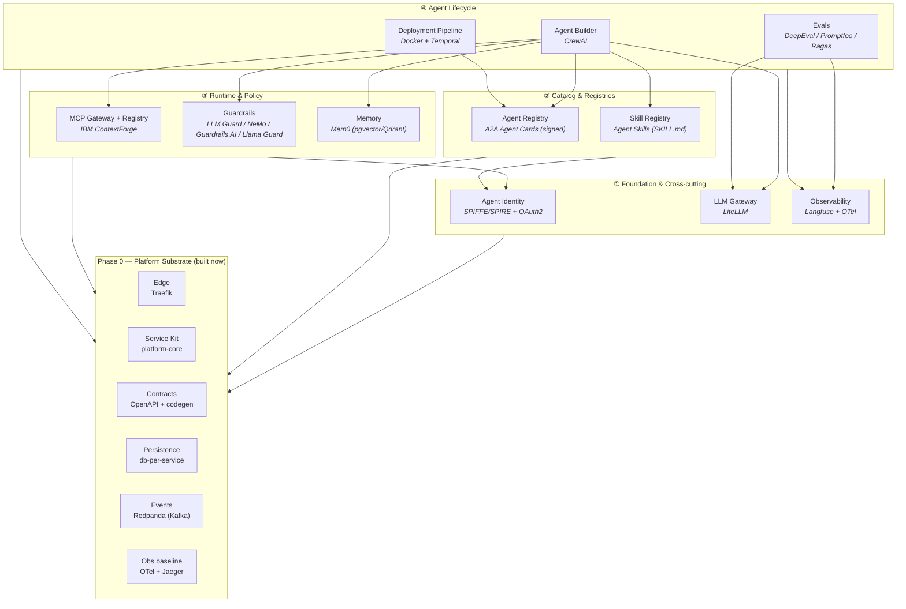

# Architecture

NotGovHarness is a locally-runnable reference implementation of a complete agentic platform:
12 "harnesses" across 4 dependency layers, all built on a shared Phase 0 substrate.

See [decisions.md](decisions.md) for the rationale behind every choice below.

## Platform map (harnesses + chosen anchors)

## Engine map

| Engine | Owning services | Started in compose |
|---|---|---|
| Postgres | LiteLLM, Builder, Deploy (Temporal), Agent Registry, Identity authz, Guardrails, Evals, ContextForge | Phase 0 (shared container, db-per-service) |
| ClickHouse + Redis + MinIO | Observability (Langfuse) | when Observability is built |
| MinIO (object store) | Skill Registry bundles (shared object store) | when Skill Registry is built |
| Vector (pgvector / Qdrant) | Memory | when Memory is built |
| Temporal datastore | Deployment Pipeline orchestration | when Deployment is built |
| SPIRE datastore | Agent Identity | when Identity is built |

Compose uses **profiles** so only the engines a given active service needs are started.

## Phase 0 substrate

The substrate is the only thing built in the first cycle. Every harness plugs into it. Two
service shapes are supported by the shared kit:

- **Greenfield service** — a FastAPI service owning its data (e.g. Agent Registry, Skill Registry).
- **Façade / adapter service** — wraps an upstream OSS project (LiteLLM, ContextForge, Langfuse,
  Temporal) behind the platform's OpenAPI contract + identity + OTel + events.

Detailed substrate design: see the Phase 0 spec in
[superpowers/specs/](superpowers/specs/).
