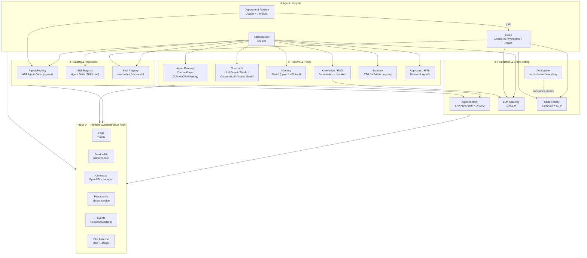
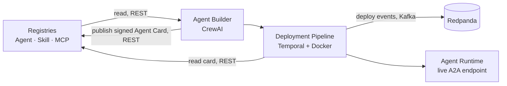

# Architecture

NotGovHarness is a locally-runnable reference implementation of a complete agentic platform:
16 "harnesses" across 4 dependency layers, all built on a shared Phase 0 substrate.

See [decisions.md](decisions.md) for the rationale behind every choice below.

## Platform map (harnesses + chosen anchors)



## Engine map

| Engine | Owning services | Started in compose |
|---|---|---|
| Postgres | LiteLLM, Builder, Deploy (Temporal), Agent Registry, Identity authz, Guardrails, Evals, ContextForge, Sandbox jobs, Approvals, Audit (hash-chained) | Phase 0 (shared container, db-per-service) |
| ClickHouse + Redis + MinIO | Observability (Langfuse) | when Observability is built |
| MinIO (object store) | Skill Registry bundles, Eval Registry datasets (shared object store) | when owning harness is built |
| Vector (pgvector / Qdrant) | Memory, Knowledge/RAG | when owning harness is built |
| Temporal datastore | Deployment Pipeline orchestration | when Deployment is built |
| SPIRE datastore | Agent Identity | when Identity is built |

Compose uses **profiles** so only the engines a given active service needs are started.

## Interconnect — connectors & surfaces

How the harnesses speak to one another. Full visual reference (control + data plane,
surfaces table, cross-cutting planes): the "Connectors & Surfaces" artifact.

**Connectors (protocols on the wire):** `REST/OpenAPI` (default, generated clients) ·
`OpenAI API` (→ LLM Gateway) · `MCP` (→ MCP Gateway → servers) · `A2A` (agent↔agent, signed
Agent Cards) · `SPIFFE Workload API` + `OAuth2` (Identity) · `OTLP` (→ Observability) ·
`Kafka` (async events) · `S3` (bundles/artifacts).

**Data plane — one request through a running agent:**

```mermaid
sequenceDiagram
    participant C as Caller
    participant ID as Identity
    participant RT as Agent Runtime
    participant GR as Guardrails
    participant MEM as Memory
    participant RAG as Knowledge/RAG
    participant GW as LLM Gateway
    participant MG as Agent Gateway
    participant SBX as Sandbox
    participant HITL as Approvals
    C->>ID: get scoped token (OAuth2)
    C->>RT: invoke task (A2A, mTLS/SVID)
    RT->>GR: check(input) (REST)
    RT->>MEM: retrieve memory (REST)
    RT->>RAG: retrieve grounding (REST, provenance)
    loop reason / act
        RT->>GW: chat/completion (OpenAI API)
        RT->>MG: call tool via Agent Gateway (MCP/A2A)
        RT->>SBX: run code (isolated, E2B)
        RT->>HITL: approve risky action? (Temporal signal)
    end
    RT->>GR: check(output) (REST)
    RT->>MEM: persist (REST)
    RT->>C: result (A2A)
    Note over C,MG: every hop: mTLS (SPIFFE) + scoped token (OAuth2); all spans -> OTLP -> Observability
```

**Control plane — build & deploy:**



## Phase 0 substrate

The substrate is the only thing built in the first cycle. Every harness plugs into it. Two
service shapes are supported by the shared kit:

- **Greenfield service** — a FastAPI service owning its data (e.g. Agent Registry, Skill Registry).
- **Façade / adapter service** — wraps an upstream OSS project (LiteLLM, ContextForge, Langfuse,
  Temporal) behind the platform's OpenAPI contract + identity + OTel + events.

Detailed substrate design: see the Phase 0 spec in
[superpowers/specs/](superpowers/specs/).
